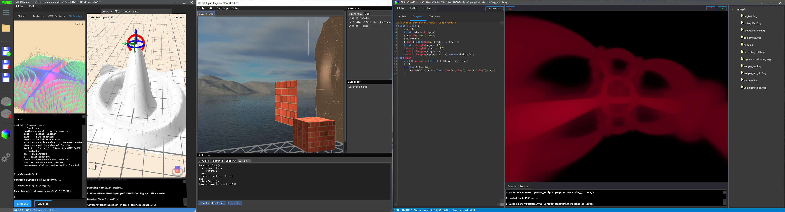

# mV3D

This is 3 separate programs merged into one (mv3DViewer, ShadeD and Multiplex engine) that I made and merges and combines them all into one program I call mV3D.
It's a project that mainly deals with 3D modelling, graphics, shaders etc. A lot of this project is unfinished.

This project is separate to a similar project called `mVCMD`

## mV3DViewer
mV3DViewer is the, base program, created in C# WPF (and utilizes HelixToolKit library) that loads basic wavefront 3D models and is able to create very simple geometric models. It has simple cloth physics as well, cutting objects (based on normal vectors), 3D mathematical expression modelling tool and
an unfinished scripting engine called mV3DScript.

## ShadeD
ShadeD is also made with C# WPF and runs GLSL shader code under WebGL interface (similar to that of popular Shadertoy site). To run it you would type in `shaded` within the mV3DViewer console. The program relies on a vertex and fragment shader and is configurable through a pseudo-markup language where you can load youtube videos in the
background and load textures from external sources. It is also able to set the shaders as wallpapers using Win32 API (although not recommended as it can be heavy on the GPU). I made a repository containing all the shaders I've written under ShadeD [here](https://github.com/JoenTheWizard/Raymarching-Stuff)

## Multiplex Engine
Multiplex Engine is created in C++ with Dear ImGUI and GLFW and to launch it you would need to type in `multiplex` within the mV3DViewer console. You can also import basic wavefront 3D models, and also edit the shaders of the models with a real-time GLSL editor, water render, list the normal and diffusion maps and create light sources. It also provides joystick compatibility and a Lua scripting engine with some examples in `LuaMultiplexExamples/` (Note that the Lua scripting engine includes all the standard libararies).

## Preview
mV3DViewer (left), Multiplex Engine (middle), ShadeD (right)

